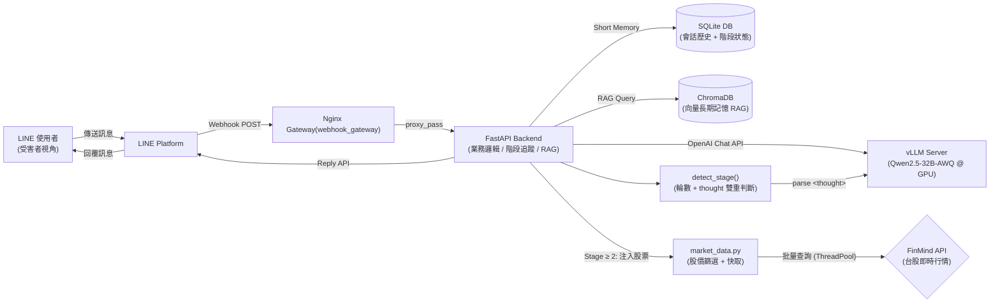
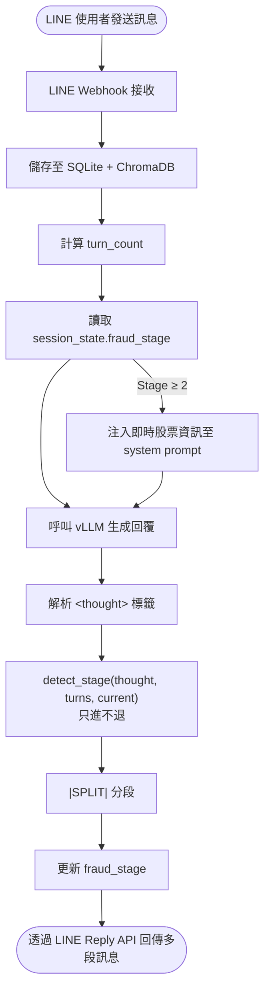

# 系統架構（Mermaid）

## 整體架構

## 對話流程（階段推進）

## 服務元件說明

| 服務 | 容器名稱 | 說明 |
|------|----------|------|
| **vLLM Server** | `vllm_server` | 本地 GPU 推理引擎，部署 Qwen2.5-32B-AWQ 模型 |
| **FastAPI Backend** | `fastapi_backend` | 核心業務邏輯，處理對話、階段追蹤、RAG 記憶、LINE Webhook |
| **Webhook Gateway** | `webhook_gateway` | Nginx 反向代理，僅暴露 LINE Webhook 路由 |

> **備註**：使用者介面完全透過 LINE Messaging API 提供，不再使用獨立的 Streamlit 前端。
> LINE 使用者的訊息會經由 LINE Platform → Nginx → FastAPI `/line/webhook` 路由處理。
