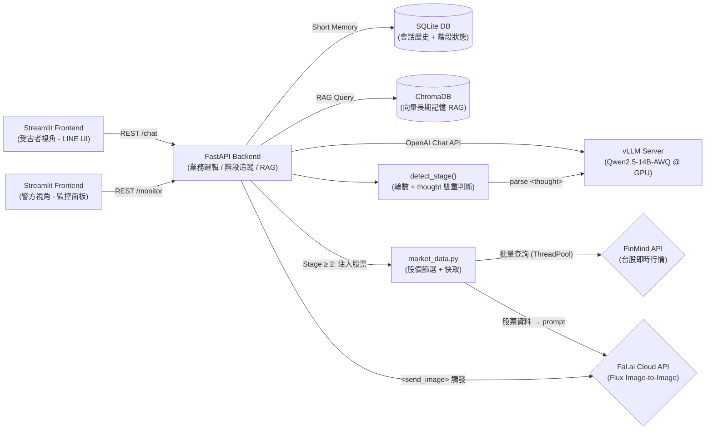
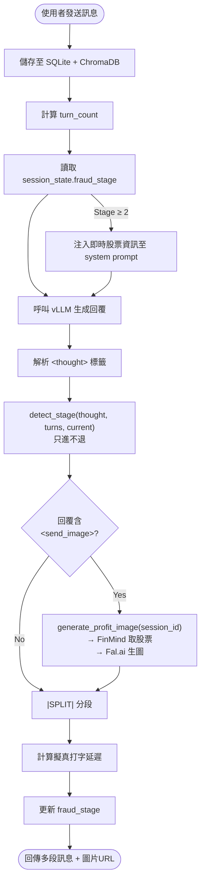

# 系統架構（Mermaid）

## 整體架構

```mermaid
flowchart LR
    VictimUI["Streamlit Frontend<br/>(受害者視角 - LINE UI)"]
    PoliceUI["Streamlit Frontend<br/>(警方視角 - 監控面板)"]
    FastAPI["FastAPI Backend<br/>(業務邏輯 / 階段追蹤 / RAG)"]
    SQLite[("SQLite DB<br/>(會話歷史 + 階段狀態)")]
    ChromaDB[("ChromaDB<br/>(向量長期記憶 RAG)")]
    vLLM["vLLM Server<br/>(Qwen2.5-14B-AWQ @ GPU)"]
    FalAPI{"Fal.ai Cloud API<br/>(Flux Image-to-Image)"}
    FinMind{"FinMind API<br/>(台股即時行情)"}
    MarketData["market_data.py<br/>(股價篩選 + 快取)"]
    StageDetect["detect_stage()<br/>(輪數 + thought 雙重判斷)"]

    VictimUI -->|"REST /chat"| FastAPI
    PoliceUI -->|"REST /monitor"| FastAPI
    FastAPI -->|Short Memory| SQLite
    FastAPI -->|RAG Query| ChromaDB
    FastAPI -->|OpenAI Chat API| vLLM
    FastAPI --> StageDetect
    StageDetect -->|"parse &lt;thought&gt;"| vLLM
    FastAPI -->|"Stage ≥ 2: 注入股票"| MarketData
    MarketData -->|"批量查詢 (ThreadPool)"| FinMind
    FastAPI -->|"&lt;send_image&gt; 觸發"| FalAPI
    MarketData -->|"股票資料 → prompt"| FalAPI
```

## 對話流程（階段推進）

```mermaid
flowchart TD
    Start([使用者發送訊息]) --> Save[儲存至 SQLite + ChromaDB]
    Save --> Count[計算 turn_count]
    Count --> GetStage[讀取 session_state.fraud_stage]
    GetStage --> LLM[呼叫 vLLM 生成回覆]
    GetStage -->|"Stage ≥ 2"| Inject[注入即時股票資訊至 system prompt]
    Inject --> LLM
    LLM --> ParseThought["解析 &lt;thought&gt; 標籤"]
    ParseThought --> DetectStage["detect_stage(thought, turns, current)<br/>只進不退"]
    DetectStage --> CheckImage{"回覆含<br/>&lt;send_image&gt;?"}
    CheckImage -->|Yes| GenImage["generate_profit_image(session_id)<br/>→ FinMind 取股票<br/>→ Fal.ai 生圖"]
    CheckImage -->|No| Split
    GenImage --> Split["|SPLIT| 分段"]
    Split --> Delay[計算擬真打字延遲]
    Delay --> UpdateState[更新 fraud_stage]
    UpdateState --> Reply([回傳多段訊息 + 圖片URL])
```
